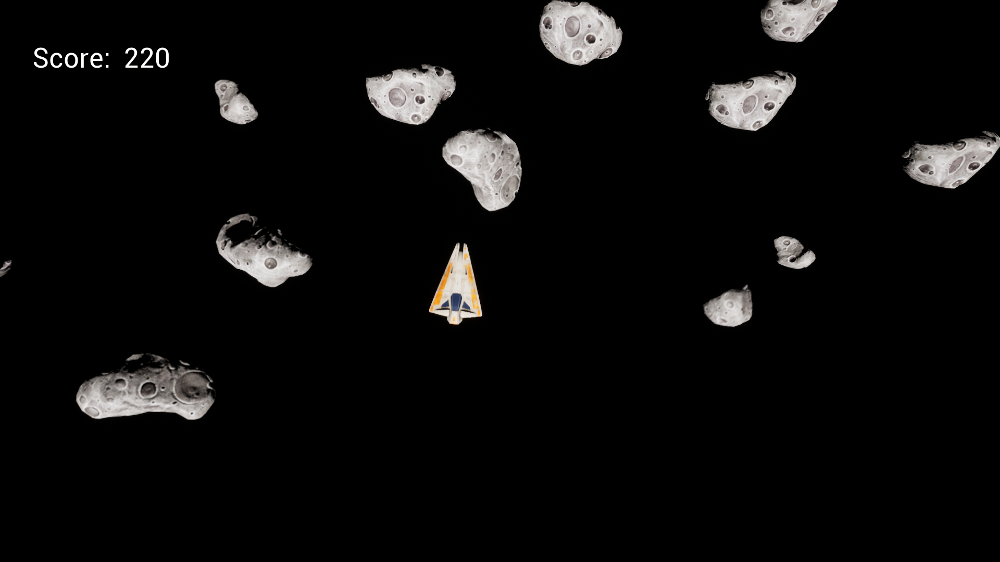

# UnrealAsteroidsCPP_Repo
 
Unreal Engine Asteroids using C++

 A simple 1-player game inspired by the classic "Asteroids." Created in Unreal; used C++ extensively for the game logic

 ## [Click here for Game Executable](https://drive.google.com/drive/folders/15i5Xb6HKLcBtf1R0v_wI6wV__0t0CA9n?usp=sharing) 

 

